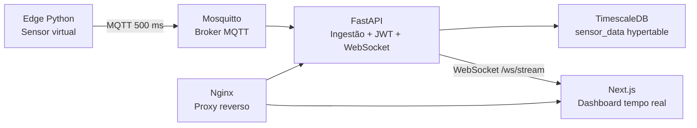

# IoT Energy Dashboard


Protótipo funcional de monitoramento energético em tempo real. O projeto simula um sensor IoT de borda, processa leituras em um backend FastAPI, persiste dados em TimescaleDB/PostgreSQL e exibe um dashboard Next.js com gráfico em tempo real e custo estimado em reais.

## Sumário

- [Arquitetura](#arquitetura)
- [Funcionalidades](#funcionalidades)
- [Stack](#stack)
- [Execução com Docker](#execução-com-docker)
- [Validação rápida](#validação-rápida)
- [API](#api)
- [Estrutura do projeto](#estrutura-do-projeto)
- [Variáveis de ambiente](#variáveis-de-ambiente)
- [Documentação complementar](#documentação-complementar)

## Arquitetura



Fluxo principal:

1. O sensor virtual gera tensão, corrente e potência ativa a cada 500 ms.
2. O Edge aplica filtro de média móvel antes de publicar os dados.
3. O backend consome mensagens MQTT, salva no banco e envia eventos via WebSocket.
4. O dashboard atualiza o gráfico com throttling para evitar travamentos.
5. O consumo acumulado em kWh é calculado a partir das leituras de potência.

## Funcionalidades

- Sensor virtual em Python com simulação de outliers e quedas de conexão.
- Filtro de média móvel configurável na camada Edge.
- Ingestão MQTT assíncrona no backend.
- Persistência em TimescaleDB com hypertable e índice por timestamp.
- Endpoint protegido por JWT para configuração remota do sensor.
- Endpoint de consumo acumulado em kWh por integração temporal.
- Tarifa simulada: R$ 0,90/kWh entre 18h e 21h, R$ 0,50/kWh nos demais horários.
- Dashboard Next.js com gráfico de linha em tempo real e throttling no cliente.
- Nginx como proxy reverso para frontend, API, Swagger e WebSocket.

## Stack

| Camada | Tecnologia |
| --- | --- |
| Edge | Python 3.11, aiomqtt |
| Broker | Eclipse Mosquitto |
| Backend | FastAPI, asyncpg, PyJWT, Gunicorn/Uvicorn |
| Banco | PostgreSQL + TimescaleDB |
| Frontend | Next.js 14, React, Recharts, Tailwind CSS |
| Infra | Docker Compose, Nginx |

## Execução com Docker

Pré-requisitos:

- Docker Desktop instalado e em execução.
- Portas `8080`, `5432` e `1883` livres na máquina.

Suba a stack completa:

```bash
docker compose up -d --build
```

Acompanhe os logs:

```bash
docker compose logs -f backend edge frontend proxy
```

Acesse:

| Serviço | URL |
| --- | --- |
| Dashboard | http://localhost:8080 |
| Swagger/FastAPI | http://localhost:8080/docs |
| Health check | http://localhost:8080/health |

Credenciais de demonstração:

| Campo | Valor |
| --- | --- |
| Usuário | `admin` |
| Senha | `admin` |

## Validação rápida

Confira se todos os containers estão ativos:

```bash
docker compose ps
```

Teste a API:

```bash
curl http://localhost:8080/health
```

Consulte dados persistidos:

```bash
docker compose exec db psql -U postgres -d iot_dashboard -c "SELECT count(*) AS total_readings, max(time) AS latest_reading FROM sensor_data;"
```

Gere um token e consulte consumo:

```bash
curl -X POST http://localhost:8080/api/auth/token \
  -H "Content-Type: application/x-www-form-urlencoded" \
  -d "username=admin&password=admin"
```

## API

| Método | Rota | Proteção | Descrição |
| --- | --- | --- | --- |
| `GET` | `/health` | Pública | Status da aplicação |
| `POST` | `/api/auth/token` | Pública | Gera token JWT |
| `GET` | `/api/readings` | Pública | Lista leituras recentes |
| `GET` | `/api/consumption` | JWT | Retorna kWh acumulado e custo estimado |
| `POST` | `/api/sensor/config` | JWT | Atualiza intervalo e janela da média móvel |
| `WS` | `/ws/stream` | Pública | Stream em tempo real para o dashboard |

Exemplo de configuração protegida:

```bash
curl -X POST http://localhost:8080/api/sensor/config \
  -H "Authorization: Bearer <TOKEN>" \
  -H "Content-Type: application/json" \
  -d '{"interval_ms": 500, "moving_average_window": 5}'
```

## Estrutura do projeto

```text
.
├── backend/          # API FastAPI, ingestão MQTT, JWT e cálculo de consumo
├── edge/             # Sensor virtual Python
├── frontend/         # Dashboard Next.js
├── proxy/            # Nginx reverse proxy
├── docs/             # Arquitetura e roteiro de demonstração
├── init.sql          # Schema TimescaleDB
├── mosquitto.conf    # Configuração do broker MQTT
└── docker-compose.yml
```

## Variáveis de ambiente

Use `.env.example` como referência para customizar a execução local. O `docker-compose.yml` já possui valores padrão seguros para demonstração.

## Documentação complementar

- [Arquitetura técnica](docs/ARCHITECTURE.md)
- [Roteiro para gravação do vídeo](docs/DEMO_SCRIPT.md)
- [Changelog](CHANGELOG.md)

## Desenvolvimento

Backend:

```bash
cd backend
python -m pip install -r requirements.txt
python -m pytest -v
```

Frontend:

```bash
cd frontend
npm install
npm run build
```

## Observações de entrega

Este projeto foi estruturado para avaliação técnica: a execução principal é feita por Docker Compose e todos os serviços necessários sobem em conjunto. Para a entrega em vídeo, siga o roteiro em `docs/DEMO_SCRIPT.md`.
