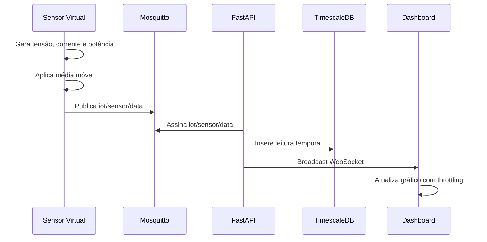

# Arquitetura Técnica

## Visão geral

O sistema foi dividido em seis serviços Docker para simular uma arquitetura IoT realista:

| Serviço | Responsabilidade |
| --- | --- |
| `edge` | Simula hardware IoT e publica leituras filtradas |
| `broker` | Intermedeia mensagens MQTT entre Edge e backend |
| `backend` | Ingere dados, autentica rotas, calcula consumo e transmite WebSocket |
| `db` | Armazena leituras temporais em TimescaleDB |
| `frontend` | Renderiza dashboard em tempo real |
| `proxy` | Centraliza o acesso HTTP/WebSocket via Nginx |

## Fluxo de dados



## Edge

O sensor virtual gera:

- Potência ativa em watts (`power`).
- Tensão em volts (`voltage`).
- Corrente em ampères (`current`).

Antes do envio, o sensor aplica média móvel em tensão e corrente. O script também simula:

- Outliers periódicos.
- Quedas de conexão MQTT.
- Reconfiguração remota via tópico `iot/sensor/config`.

## Backend

O backend usa FastAPI com execução ASGI via Gunicorn/Uvicorn.

Responsabilidades principais:

- Consumir mensagens MQTT do tópico `iot/sensor/data`.
- Validar payloads com Pydantic.
- Persistir leituras em TimescaleDB usando `asyncpg`.
- Enviar leituras para o dashboard por WebSocket.
- Gerar JWT em `/api/auth/token`.
- Proteger `/api/sensor/config` e `/api/consumption`.

## Banco de dados

A tabela `sensor_data` é uma hypertable TimescaleDB particionada por `time`.

Campos:

| Campo | Tipo | Descrição |
| --- | --- | --- |
| `time` | `TIMESTAMPTZ` | Timestamp da leitura |
| `voltage` | `DOUBLE PRECISION` | Tensão em V |
| `current` | `DOUBLE PRECISION` | Corrente em A |
| `power` | `DOUBLE PRECISION` | Potência ativa em W |

O índice `idx_sensor_data_time_desc` acelera consultas recentes e agregações por timestamp.

## Cálculo de consumo

O consumo acumulado é calculado por integração trapezoidal entre pares de leituras consecutivas:

```text
potência_média_W = (potência_anterior_W + potência_atual_W) / 2
energia_kWh = potência_média_W * duração_s / 3600 / 1000
```

O backend usa a diferença entre timestamps consecutivos para calcular `duração_s`. Para evitar distorções em longas quedas de conexão, intervalos acima de 5 segundos são ignorados no cálculo agregado.

## Tarifas

| Período | Horário | Tarifa |
| --- | --- | --- |
| Ponta | 18h até 21h | R$ 0,90/kWh |
| Normal | Demais horários | R$ 0,50/kWh |

O cálculo usa o fuso `America/Sao_Paulo`.

## Performance no frontend

O dashboard recebe dados em tempo real via WebSocket, mas aplica throttling antes de atualizar estado React. Isso reduz renderizações e evita travamento do navegador em fluxos contínuos.
